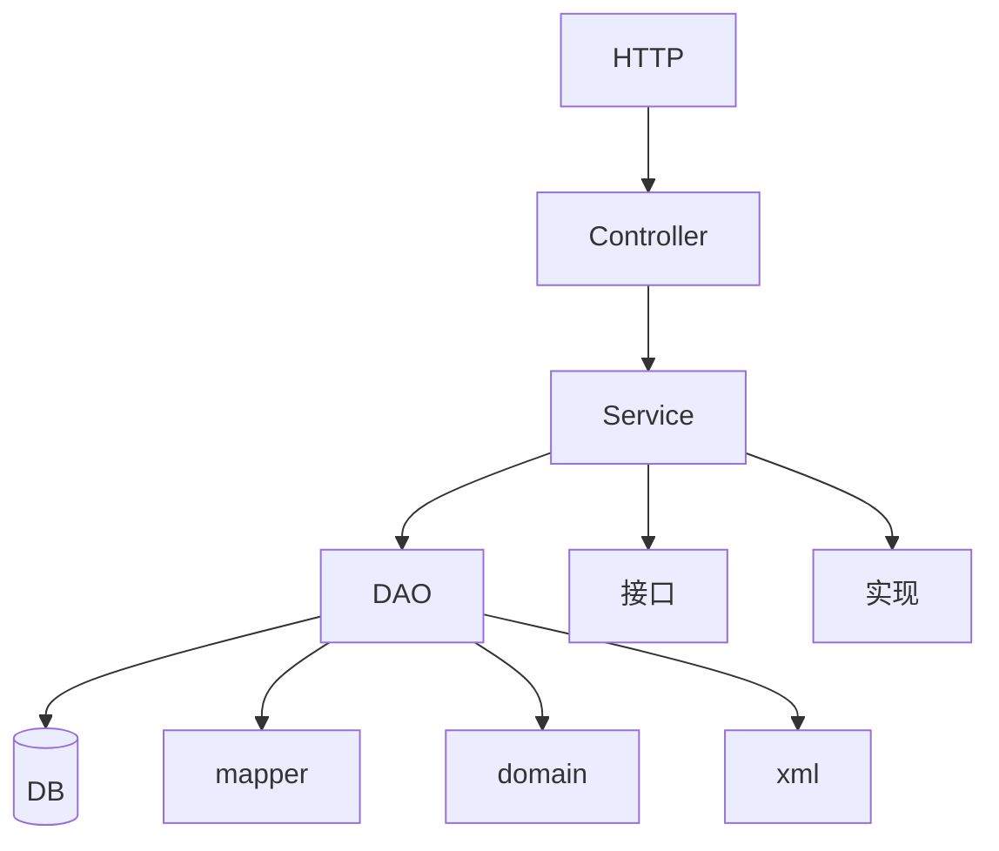

## 架构说明

该系统采用标准的多层架构设计，主要包含以下几层：

1. **HTTP层**
   - 处理所有的HTTP请求入口

2. **Controller层**
   - 负责请求的处理和路由
   - 数据的基本验证
   - 返回响应结果

3. **Service层**
   - 包含核心业务逻辑
   - 分为接口定义和具体实现
   - 处理事务管理

4. **DAO层**
   - 负责数据访问
   - 包含以下组件：
     * Mapper接口
     * Domain实体类
     * XML映射文件

5. **数据库层**
   - 数据的持久化存储

## 相关文件结构

